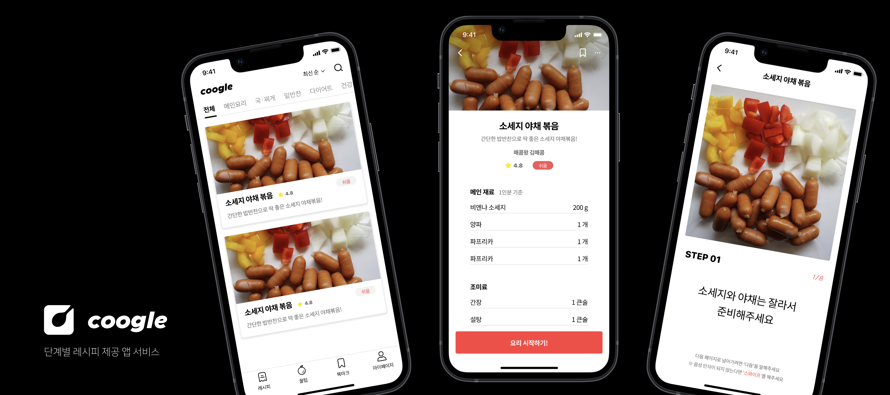
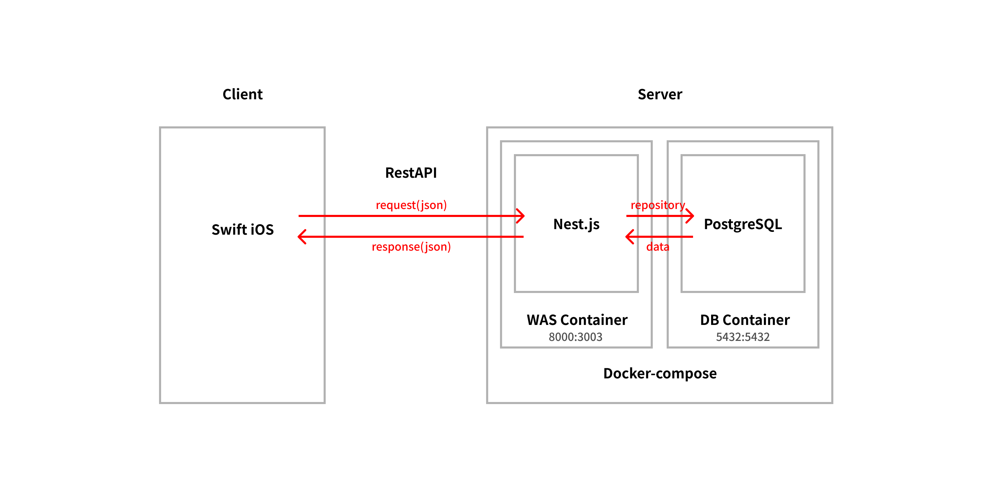
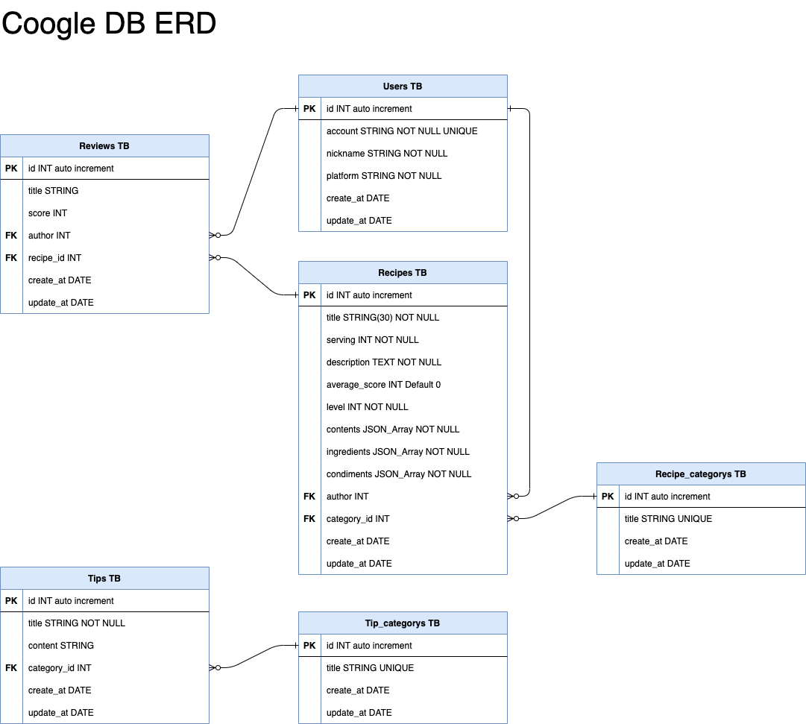

# Coogle-official



- 단계별 요리 레시피 정보 제공 앱 어플리케이션.
- 테스트 영상 링크 : https://www.youtube.com/watch?v=Xs2p8c-XiV4

<br>

## 👥 협업 역할

- 서비스 기획 : 이권석, 장재형
- UX/UI 디자인 : 이권석
- iOS 프론트 개발 : 장재형
- 백엔드 서버 개발 : 이권석

<br>

## ⚒️ Skill Set

- Programming : `Typescript` , `Nest.js`
- Database & ORM : `PostgreSQL` , `TypeORM`
- API Test : `Postman`
- Container : `Docker`

<br>

## 🤔 구현 내용



### 레시피, 리뷰, 요리 정보 API 개발

- MySQL, Sequelize 기반의 RestAPI 설계
- 비정형 데이터(레시피 내용)은 json array 타입으로 DB에 저장
- TypeORM 0.2v 에서 0.3v 으로 마이그레이션

### JWT 인증 토큰 활용 및 유효성 체크 기능 개발

- JWT token 을 활용한 로그인 / 로그아웃 기능
- 유효성 체크 및 접근 권한 기능

### Docker로 개발 환경 컨테이너화

- docker-compose 를 활용한 여러 소프트웨어 독립적 관리
- 클라이언트 개발자의 로컬 개발 경험 개선

<br>

## ⚙️ Running the App

```bash
# Docker-Compose Running
$ docker-compose up # dev mode

# Running the App in local
$ npm run start:dev  # dev mode
```

<br>

## Database



<br>
